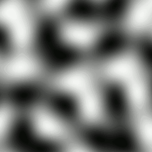
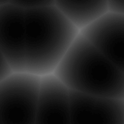

# World Generator

## Table of Contents

- [Basic concepts](#basic-concepts)
- [Global variables](#global-variables)
- [Configuration file](#configuration-file)
- [Fragments](#fragments)
- [Structures](#structures)
- [Biomes](#biomes)
   * [Biome parameters](#biome-parameters)
   * [Biome selection](#biome-selection)
- [Heightmap](#heightmap)
   * [Constructor](#constructor)
   * [Unary operations](#unary-operations)
   * [binary operations](#binary-operations)
   * [heightmap:dump(...)](#heightmapdump)
   * [heightmap:noise(...)](#heightmapnoise)
   * [heightmap:cellnoise(...)](#heightmapcellnoise)
   * [heightmap:resize(...)](#heightmapresize)
   * [heightmap:crop(...)](#heightmapcrop)
   * [heightmap:at(x, y)](#heightmapatx-y)
- [VoxelFragment (fragment in Lua)](#voxelfragment-fragment-in-lua)
- [Generating a height map](#generating-a-height-map)
- [Manual structures placement](#manual-structures-placement)
   * [Structure/tunnel placements](#structuretunnel-placements)
   * [Small structures placement](#small-structures-placement)
   * [Wide structures placement](#wide-structures-placement)
- [Structural air](#structural-air)
- [Generator 'Demo' (base:demo)](#generator-demo-basedemo)

## Basic concepts

Concepts used in the text below.

- **Combined array/object** - TOML or JSON file that is combined from several versions in different packs, which allows adding data to it from outside. The fields of the combined object are overwritten in order from first to last, just like other resources in the packs. In the case of a combined array, a check for duplicates is **not** performed.
- **Biome** - information that determines what blocks and what layers the terrain is generated from, as well as a set of plants, structures.
- **Plant** - a block randomly placed on the surface.
- **Small structure** - a structure whose size does not exceed the size of a chunk. Example: trees.

## Configuration file

The world generator is recognized if the file `generators/generator_name.toml` is present. Other files related to the generator are located in the directory `generators/generator_name.files/`:
- biomes.toml - biome definitions
- structures.toml - structure definitions
- script.lua - generator script
- fragments - directory where fragment files are located

The main properties described in the configuration file:
- **caption** - the generator display name. By default, it is generated from the id.
- **biome-parameters** - the number of biome selection parameters (from 0 to 4). Default: 0.
- **sea-level** - sea level (below this level, sea-layers will be generated instead of air). Default: 0.
- **biomes-bpd** - number of blocks per point of the biome selection parameter map. Default: 4.
- **heights-bpd** - number of blocks per point of the height map. Default: 4.
- **wide-structs-chunks-radius** - maximum radius for placing 'wide' structures, measured in chunks.
- **heightmap-inputs** - an array of parameter map numbers that will be passed by the inputs table to the height map generation function.

## Global variables

The following variables are available in the generator script:

- `SEED` - world generation seed
- `__DIR__` - generator directory (`pack:generators/generator_name.files/`)
- `__FILE__` - script file (`pack:generators/generator_name.files/script.lua`)

## Fragments

A fragment is a region of the world, like a chunk, saved for later use, limited by a certain width, height and length. A fragment can contain data not only blocks, but also the block inventories and entities. Unlike a chunk, the size of a fragment is arbitrary.

Fragment can be created using the `fragment.save` command, or the `generation.create_fragment` function.

Fragments used by the generator must present in the directory:
`generators/generator_name.files/fragments/`

## Structures

A structure is a set of rules for inserting a fragment into the world by the generator. Structures are declared as objects in the file `generators/generator_name.files/structures.toml`. Example:
```toml
tree0 = {}
tree1 = {}
tree2 = {}
tower = {lowering=2}
coal_ore0 = {}
```

Currently, the name of the structure must match the name of the fragment used.

Available properties:
- lowering - depth of structure lowering.

## Biomes

A biome defines what blocks and layers the terrain is generated from, as well as a set of plants and structures.

Biomes are defined in a combined object:
`generators/generator_name.files/biomes.toml`

Let's look at the biome structure using the forest example from the base:demo generator:

```toml
[forest]
parameters = [
    {weight=1, value=1},
    {weight=0.5, value=0.2}
]
layers = [
    {below-sea-level=false, height=1, block="base:grass_block"},
    {below-sea-level=false, height=7, block="base:dirt"},
    {height=-1, block="base:stone"},
    {height=1, block="base:bazalt"}
]
sea-layers = [
    {height=-1, block="base:water"}
]
plant-chance = 0.4
plants = [
    {weight=1, block="base:grass"},
    {weight=0.03, block="base:flower"}
]
structure-chance = 0.032
structures = [
    {name="tree0", weight=1},
    {name="tree1", weight=1},
    {name="tree2", weight=1},
    {name="tower", weight=0.002}
]
```

- key 'forest' - biome name
- parameters - weights and central values ​​of the parameters for the biome. See the [biome selection](#biome-selection) section. The number of entries must match the number of biome selection parameters.
- layers - block layers from top to bottom.
    - height - layer height in blocks. -1 is used to mark the filler layer, of which there can only be one. Its height is calculated automatically.
    - block - full block name
    - below-sea-level - whether the layer can be generated below sea level (example: turf). If false, when generated below sea level, the layer will be replaced by the next one.
- sea-layers - ocean layers. The position of the top layer coincides with the sea level height.
- plant-chance - probability of generating a plant on a surface block.
- plants - plants randomly placed on the surface.
    - weight - weight directly affecting the chance of selecting a specific plant.
    - block - plant block
- structure-chance - probability of generating a small structure on a surface block.
- structures - structures randomly placed on the surface.
    - name - name of the structure declared in `structures.toml`.
    - weight - weight directly affecting the chance of choosing a specific structure.

### Biome Parameters

The generator parameter `biome-parameters` defines the number of biome selection parameters (examples: temperature, humidity).

Biome parameter value maps are generated in the same way as height maps.

It is required to implement the function:
```lua
-- x, y - map start position (in dots)
-- w, h - map width and height (in dots)
-- bpd - (blocks per dot) number of blocks per dot (scale)
function generate_biome_parameters(x, y, w, h, bpd)
    -- creating heightmaps for each biome parameter
    -- ...
    return comma-separated_maps
end

-- example
function generate_biome_parameters(x, y, w, h, s)
    -- temperature map
    local tempmap = Heightmap(w, h)
    tempmap.noiseSeed = SEED + 5324
    tempmap:noise({x, y}, 0.04*s, 6)
    tempmap:pow(3)
    -- humidity map
    local hummap = Heightmap(w, h)
    hummap.noiseSeed = SEED + 953 
    hummap:noise({x, y}, 0.04*s, 6) 
    hummap:pow(3) 
    return tempmap, hummap 
end
```

### Biome selection

After generating the parameter maps for each biome, scores are calculated for all parameters:

$score = \frac{|V - V_b|}{W_b}$

Where $V$ is the parameter value, $V_b$ is the central parameter value for the biome, $W_b$ is the biome weight for the parameter.

The generator selects the biome with the **least** sum of parameter scores.

>[!WARNING]
> If the parameter values ​​and weights are not set up correctly, biomes may have an effect similar to the depth conflict in 3D graphics when two surfaces overlap.
>
   In the case of biomes, the pattern looks random due to the distortion of these 'surfaces' by the noise used to generate the parameter maps.
   >
   To get rid of the effect, you can either adjust the weights or parameter values ​​of the biomes, or increase the difference in the generation of the parameter maps.

## Heightmap

Heightmap is a class for working with heightmaps (arbitrarily sized matrices of floating point numbers).

### Constructor

The heightmap constructor requires integer width and height.

```lua
local map = Heightmap(width, height)
```

### Unary Operations

Operations apply to all height values.

```lua
map:abs()
```

Casts height values ​​to absolute.

### Binary Operations

Operations using a second map or a scalar.

Arithmetic operations:

```lua
-- Addition
map:add(value: Heightmap|number)

-- Subtraction
map:sub(value: Heightmap|number)

-- Multiplication
map:mul(value: Heightmap|number)

-- Exponentiation
map:pow(value: Heightmap|number)
```

Other operations:

```lua
-- Minimum
map:min(value: Heightmap|number)

-- Maximum
map:max(value: Heightmap|number)

-- Mixing
map:mixin(value: Heightmap|number, t: Heightmap|number)
-- t - mixing factor from 0.0 to 1.0
-- mixing is performed according to the formula:
--    map_value * (1.0 - t) + value * t
```

### heightmap:dump(...)

A method used for debugging, creates an image based on a heightmap by converting values ​​from the range `[-1.0, 1.0]` to brightness values ​​`[0, 255]`, saving it to the specified file.

```lua
map:dump('export:test.png')
```

### heightmap:noise(...)

A method that generates simplex noise, adding it to the existing values.

The noise seed can be specified in the `map.noiseSeed` field.

```lua
map:noise(
-- coordinate offset
offset: {number, number},
-- coordinate scaling factor
scale: number,
-- number of noise octaves (default: 1)
[optional] octaves: integer,
-- noise amplitude multiplier (default: 1.0)
[optional] multiplier: number,
-- X coordinate offset map for noise generation
[optional] shiftMapX: Heightmap,
-- Y coordinate offset map for noise generation
[optional] shiftMapY: Heightmap,
) -> nil
```

Noise visualization with octaves 1, 2, 3, 4, and 5.



### heightmap:cellnoise(...)

Analog of heightmap:noise that generates cellular noise.

The noise seed can be specified in the `map.noiseSeed` field.



### heightmap:resize(...)

```lua
map:resize(width, height, interpolation)
```

Changes the heightmap size.

Available interpolation modes:
- 'nearest' - no interpolation
- 'linear' - bilinear interpolation
- 'cubic' - bicubic interpolation

### heightmap:crop(...)

```lua
map:crop(x, y, width, height)
```

Crops the heightmap to the specified area.

### heightmap:at(x, y)

```lua
map:at(x, y) --> number
```

Returns the height value at the specified position.

## VoxelFragment (fragment in Lua)

A fragment is created by calling the function:
```lua
generation.create_fragment(
    -- point A
    a: vec3,
    -- point B
    b: vec3,
    -- automatically crop the fragment if possible
    crop: bool
) -> VoxelFragment
```

A fragment can be loaded from a file:
```lua
generation.load_fragment(
    -- fragment file
    filename: str
) -> VoxelFragment
```

A fragment can be saved to a file:
```lua
generation.save_fragment(
    -- fragment to save
    fragment: VoxelFragment,
    -- file
    filename: str
) -> nil
```

The fragment size is available as the `size` property.

### Methods

```lua
-- Crop a fragment to content
fragment:crop()

-- Set a fragment to the world at the specified position
fragment:place(position: vec3, [optional] rotation:int=0)
```

## Generating a height map

By default, the engine generates a height map consisting of zeros.

To generate custom heightmaps, you need to implement the function:

```lua
function generate_heightmap(
    x, y, -- offset of the heightmap
    w, h, -- size of the heightmap expected by the engine
    bpd, -- number of blocks per dot - scale
    [optional] inputs -- array of input maps of biome parameters
    -- (see the heightmap-inputs property of the generator)
) --> Heightmap
```

An example of generating a heightmap from simplex noise with reduction
to the desired range:

```lua
function generate_heightmap(x, y, w, h, bpd)
    -- create a heightmap with a given size
    local map = Heightmap(w, h)
    -- set the noise seed
    map.noiseSeed = SEED
    -- noise with a scale of 1/10 by 4 octaves with an amplitude of 0.5
    map:noise({x, y}, 0.1*bpd, 4, 0.5)
    -- shift heights to positive range
    map:add(0.5)
    return map
end
```

## Manual structures placement

### Structure/tunnel placements

Placement of a structure/line is an array of a given
set of parameters.

Structure:
```lua
{structure_name, structure_position, rotation, [optional] priority}
```

Where:
- structure_name - a string containing the name of the structure, registered in structures.toml.
- structure_position - a vec3 (an array of three numbers) relative to the position of the chunk.
- rotation - a number from 0 to 3 indicating the rotation of the structure along the Y axis.
- priority - a number determining the order in which structures are placed. Structures with lower priority are overlapped by structures with higher priority.

Tunnel:
```lua
{":line", filler_block, point_a, point_b, radius}
```

Where:
- filler_block - the numeric id of the block that the structure will consist of.
- point_a, point_b - vec3, vec3 positions of the start and end of the tunnel.
- radius - radius of the tunnel in blocks

### Small structures placement

```lua
function place_structures(
    x, z, -- start position of the region in blocks
    w, d, -- size of the region in blocks
    heights, -- height map of the chunk
    chunk_height, -- height of the chunk
) --> array of structure placements
```

Structures can be placed outside the chunk, but not more than one chunk away.

Example:

```lua
function place_structures(x, z, w, d, hmap, chunk_height)
    local placements = {}
    local height = hmap:at(w/2, h/2) * chunk_height

    -- places the tower in the center of the chunk
    table.insert(placements, {
        'tower', {w/2, height, d/2}, math.random() * 4, 2
    })
    return placements
end
```

### Wide structures placement

Structures and tunnels can be placed outside a chunk, but no further than the number of chunks specified in the `wide-structs-chunks-radius` property of the generator.

Unlike the previous function, no heightmap is passed here, since the call occurs early in the chunk generation.

```lua
function place_structures_wide(
    x, z, -- start position of the region in blocks
    w, d, -- size of the region in blocks
    chunk_height, -- height of the chunk
) --> array of structure / tunnel placements
```

## Structural Air

`core:struct_air` - a block that should be used in chunks to mark empty space that should not be filled with blocks when generated in the world.

<image src="../../res/textures/blocks/struct_air.png" width="128px" height="128px" style="image-rendering: pixelated">

# Generator 'Demo' (base:demo)

## Adding new ore

To add a new ore in your pack:
1. In the `generators` folder, create a `demo.files` folder (you don't need to create demo.toml).

2. In the created folder, create a fragments folder and place the ore fragment file in it.
3. In `demo.files`, create a structures.toml file:
```toml
fragment_name = {}
```
4. Also in `demo.files`, create an ores.json file:
```json
[
    {"struct": "fragment_name", "rarity": rarity}
]
```
The higher the rarity value, the less ore generation chance.
You can rely on the rarity of coal ore: 4400.
